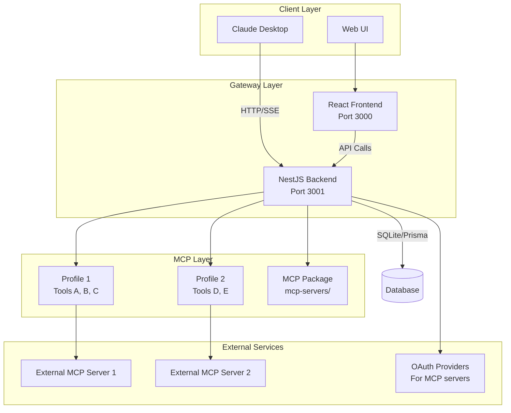
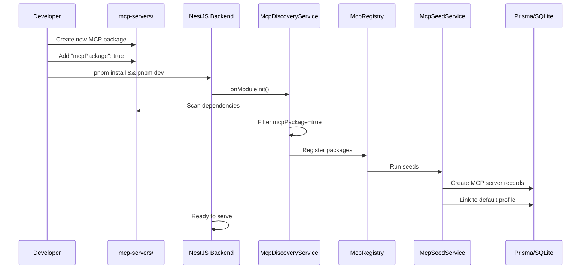
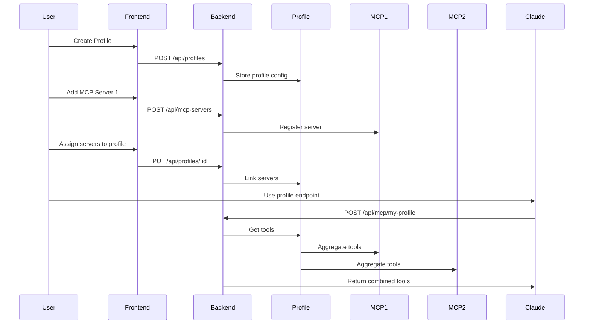

# Root Directory - Local MCP Gateway

## Project Overview

**Local MCP Gateway** is a monorepo application that serves as a local gateway for MCP (Model Context Protocol) servers. It allows users to:

- **Aggregate multiple MCP servers** (stdio, SSE, HTTP) into a single endpoint
- **Create MCP servers as packages** in `mcp-servers/` folder with auto-discovery
- **Manage servers via a Web UI** with React 19 frontend
- **Inspect MCP traffic** with built-in debug logging
- **Secure MCP servers** with API keys and OAuth 2.1 (PKCE, DCR)
- **Profile-based tool management** - group MCP servers into profiles for different use cases

**NOTE:** This application does not require user authentication. Users can immediately configure and use MCP servers without login.

This is a **pnpm workspace + Turborepo** monorepo built with:
- **Backend**: NestJS 11.x with TypeScript, Prisma ORM, SQLite
- **Frontend**: React 19 with Vite, TanStack Query, Zustand, Tailwind CSS
- **Testing**: Vitest (unit/integration), Playwright (E2E)
- **Code Quality**: Biome (linting/formatting), TypeScript strict mode
- **Build**: Turborepo for monorepo orchestration
- **MCP Servers**: Auto-discovered packages in `mcp-servers/` folder

## Setup Commands

### Prerequisites
- **Node.js**: >=22.0.0 (check `.nvmrc` for exact version)
- **pnpm**: >=9.0.0 (specified in `packageManager` field)
- **Docker**: Optional, for containerized deployment

### Initial Setup

```bash
# Install dependencies for all packages
pnpm install

# Initialize database with seed data
pnpm db:seed

# Start development
pnpm dev
```

### Development Environment

```bash
# Start both backend and frontend with hot-reload
pnpm dev

# Start only backend
pnpm dev:backend

# Start only frontend
pnpm dev:frontend
```

**Ports:**
- Backend: http://localhost:3001
- Frontend: http://localhost:3000

## Build Commands

### Production Build

```bash
# Build all packages and apps
pnpm build

# Build specific package/app
pnpm --filter backend build
pnpm --filter frontend build
```

**Build Output:**
- Backend: `apps/backend/dist/` (NestJS compiled)
- Frontend: `apps/frontend/dist/` (Vite production build)

### Type Checking

```bash
# Type check all packages
pnpm typecheck

# Type check specific package
pnpm --filter backend typecheck
pnpm --filter frontend typecheck
```

### Linting and Formatting

```bash
# Lint all packages
pnpm lint

# Format all files
pnpm format

# Check formatting without changes
pnpm format:check
```

**Linting Rules (Biome):**
- Single quotes for strings
- Semicolons required
- Trailing commas (ES5 style)
- 2-space indentation
- 100 character line width
- No unused variables
- Security rules (no dangerouslySetInnerHtml)

**Note:** `useImportType` is disabled for NestJS compatibility (dependency injection requires runtime imports).

## Visual Workflows/Diagrams

### System Architecture



### MCP Package Auto-Discovery Flow



### Profile-to-MCP Flow



## Agent-Specific Examples

### Example 1: Adding a New API Endpoint (NestJS)

**Context**: You need to add a new REST endpoint to the backend.

**Steps:**
1. **Create controller and service** in appropriate module:
   ```typescript
   // apps/backend/src/modules/my-feature/my-feature.controller.ts
   import { Controller, Get, Post, Body, Param } from '@nestjs/common';
   import { MyFeatureService } from './my-feature.service';

   @Controller('my-feature')
   export class MyFeatureController {
     constructor(private readonly myFeatureService: MyFeatureService) {}

     @Get()
     findAll() {
       return this.myFeatureService.findAll();
     }

     @Post()
     create(@Body() data: CreateDto) {
       return this.myFeatureService.create(data);
     }
   }
   ```

2. **Create service**:
   ```typescript
   // apps/backend/src/modules/my-feature/my-feature.service.ts
   import { Injectable } from '@nestjs/common';
   import { PrismaService } from '../database/prisma.service';

   @Injectable()
   export class MyFeatureService {
     constructor(private readonly prisma: PrismaService) {}

     async findAll() {
       return this.prisma.myModel.findMany();
     }
   }
   ```

3. **Create module**:
   ```typescript
   // apps/backend/src/modules/my-feature/my-feature.module.ts
   import { Module } from '@nestjs/common';
   import { MyFeatureController } from './my-feature.controller';
   import { MyFeatureService } from './my-feature.service';

   @Module({
     controllers: [MyFeatureController],
     providers: [MyFeatureService],
   })
   export class MyFeatureModule {}
   ```

4. **Register module** in `apps/backend/src/app.module.ts`

### Example 2: Creating a New MCP Package

**Context**: You need to add a new MCP server to the gateway.

**Steps:**
1. **Create package structure**:
   ```bash
   mkdir -p mcp-servers/my-mcp/src
   ```

2. **Create package.json** with `mcpPackage: true`:
   ```json
   {
     "name": "@dxheroes/mcp-my-mcp",
     "version": "1.0.0",
     "type": "module",
     "main": "./dist/index.js",
     "mcpPackage": true,
     "peerDependencies": {
       "@dxheroes/local-mcp-core": "workspace:*"
     }
   }
   ```

3. **Export McpPackage interface** from `src/index.ts`:
   ```typescript
   import type { McpPackage } from '@dxheroes/local-mcp-core';

   export const mcpPackage: McpPackage = {
     metadata: {
       id: 'my-mcp',
       name: 'My MCP',
       description: 'Description',
       version: '1.0.0',
       requiresApiKey: true,
     },
     createServer: (apiKeyConfig) => new MyMcpServer(apiKeyConfig),
     seed: {
       defaultProfile: 'default',
       defaultOrder: 10,
     },
   };

   export default mcpPackage;
   ```

4. **Run install** - package is auto-discovered!
   ```bash
   pnpm install
   pnpm dev:backend
   # Log: "Discovered X MCP packages"
   # Log: "Registered: My MCP (my-mcp)"
   ```

### Example 3: Working with Database (Prisma)

**Context**: You need to add a new database table or modify schema.

**Steps:**
1. **Edit Prisma schema**:
   ```prisma
   // packages/database/prisma/schema.prisma
   model MyModel {
     id        String   @id @default(uuid())
     name      String
     createdAt DateTime @default(now()) @map("created_at")
     updatedAt DateTime @updatedAt @map("updated_at")

     @@map("my_models")
   }
   ```

2. **Create migration**:
   ```bash
   cd packages/database
   pnpm prisma migrate dev --name add_my_model
   ```

3. **Generate client and Zod schemas**:
   ```bash
   pnpm prisma generate
   ```

4. **Use in service**:
   ```typescript
   // Use generated Prisma Client
   const items = await this.prisma.myModel.findMany();

   // Use generated Zod schema for validation
   import { MyModelCreateInputSchema } from '@dxheroes/local-mcp-database';
   const validated = MyModelCreateInputSchema.parse(input);
   ```

### Example 4: Adding E2E Test

**Context**: You need to test a complete user flow.

**Steps:**
1. **Create test file**:
   ```typescript
   // apps/frontend/e2e/my-feature.spec.ts
   import { test, expect } from '@playwright/test';

   test('user can complete flow', async ({ page }) => {
     await page.goto('/');
     // ... test steps
   });
   ```

2. **Run E2E tests**:
   ```bash
   pnpm test:e2e
   ```

## Terminology and Context

### Core Concepts

- **MCP (Model Context Protocol)**: Protocol for AI assistants to access external tools and data
- **Profile**: A named collection of MCP servers that can be accessed via a single endpoint (e.g., `/api/mcp/my-profile`)
- **MCP Server**: An implementation of the MCP protocol that provides tools/resources/prompts
- **MCP Package**: A standalone npm package in `mcp-servers/` with `mcpPackage: true`
- **Tool**: A function that an AI can call (e.g., `read_file`, `search_web`)
- **Resource**: Data that an AI can access (e.g., files, database records)

### Server Types

- **builtin**: MCP server package in `mcp-servers/` folder (auto-discovered)
- **custom**: Custom TypeScript module MCP server
- **remote_http**: External HTTP MCP server
- **remote_sse**: Server-Sent Events MCP server
- **external**: Spawned process MCP server

### Authentication

- **No User Auth**: Application does not require user login
- **OAuth 2.1 for MCP**: OAuth for MCP servers connecting to external services
- **API Keys**: For MCP servers requiring API authentication

### Architecture Terms

- **NestJS Module**: Self-contained unit with controllers, services, providers
- **Prisma Service**: Database access layer with type-safe queries
- **McpRegistry**: In-memory registry of discovered MCP packages
- **McpDiscoveryService**: Scans dependencies for `mcpPackage: true`
- **McpSeedService**: Creates database records for discovered packages

## Code Style

### TypeScript

- **Strict mode**: Enabled in all `tsconfig.json` files
- **Module system**: ES modules (`"type": "module"` in package.json)
- **Import style**: Regular imports for NestJS (DI requires runtime imports)
- **Naming**:
  - Components: PascalCase (`MyComponent.tsx`)
  - Files: kebab-case for non-components (`my-utils.ts`)
  - Types/Interfaces: PascalCase (`UserProfile`, `McpServer`)
  - NestJS: PascalCase for classes (`MyFeatureService`, `MyFeatureController`)

### Formatting (Biome)

- **Indentation**: 2 spaces
- **Line width**: 100 characters
- **Quotes**: Single quotes for strings
- **Semicolons**: Always required
- **Trailing commas**: ES5 style (objects, arrays)
- **Import organization**: Auto-organized by Biome

### File Organization

```
apps/backend/src/
├── main.ts              # NestJS bootstrap
├── app.module.ts        # Root module
├── modules/
│   ├── database/        # Prisma service (global)
│   ├── mcp/             # MCP management, discovery, registry
│   ├── profiles/        # Profile CRUD
│   ├── oauth/           # OAuth for MCP servers
│   ├── proxy/           # MCP proxy endpoints
│   ├── health/          # Health checks
│   └── debug/           # Debug logs
├── common/
│   ├── filters/         # Exception filters
│   ├── interceptors/    # Logging, timeout
│   └── pipes/           # Validation
└── config/              # App configuration

apps/frontend/src/
├── components/          # React components
├── pages/               # Page components (routes)
├── lib/                 # Shared utilities
└── utils/               # Helper functions
```

## Testing Instructions

### Test Structure

- **Unit tests**: `__tests__/unit/` - Test individual functions/components in isolation
- **Integration tests**: `__tests__/integration/` - Test multiple components together
- **E2E tests**: `apps/frontend/e2e/` - Test complete user flows with Playwright

### Running Tests

```bash
# Run all tests
pnpm test

# Run with watch mode
pnpm test:watch

# E2E tests
pnpm test:e2e

# Coverage report
pnpm test:coverage
```

### Test Best Practices

1. **Isolation**: Each test should be independent
2. **Naming**: Descriptive test names
3. **Arrange-Act-Assert**: Clear test structure
4. **Mocking**: Use MSW for API mocking in frontend tests
5. **Router Context**: Wrap components using `useNavigate` in `<MemoryRouter>`

## Project Structure

```
local-mcp-gateway/
├── apps/                          # Applications
│   ├── backend/                   # NestJS backend
│   │   └── src/modules/           # NestJS modules
│   └── frontend/                  # React 19 frontend
├── packages/                      # Shared packages
│   ├── core/                      # Core abstractions (types, interfaces)
│   │   └── src/types/
│   │       ├── mcp.ts             # MCP types
│   │       └── mcp-package.ts     # McpPackage interface
│   ├── database/                  # Database layer (Prisma ORM)
│   │   ├── prisma/
│   │   │   ├── schema.prisma      # Prisma schema
│   │   │   └── migrations/        # Prisma migrations
│   │   └── src/generated/
│   │       ├── prisma/            # Prisma Client
│   │       └── zod/               # Generated Zod schemas
│   ├── config/                    # Shared configuration
│   └── ui/                        # Shared UI components
├── mcp-servers/                   # MCP server packages (auto-discovered)
│   └── gemini-deep-research/      # Example MCP package
├── docs/                          # Documentation
├── package.json                   # Root package.json
├── pnpm-workspace.yaml            # pnpm workspace config
├── turbo.json                     # Turborepo config
└── biome.json                     # Biome linting/formatting
```

## Dependencies

### Backend Dependencies (NestJS)

- `@nestjs/common`, `@nestjs/core`: NestJS framework
- `@nestjs/config`: Configuration management
- `@nestjs/throttler`: Rate limiting
- `@modelcontextprotocol/sdk`: MCP SDK
- `helmet`: Security headers
- `compression`: Response compression
- `zod`: Schema validation

### Frontend Dependencies

- `react`, `react-dom`: React 19
- `react-router`: Routing
- `@tanstack/react-query`: Data fetching
- `zustand`: State management
- `lucide-react`: Icons
- `zod`: Schema validation

### Database Dependencies (Prisma)

- `@prisma/client`: Prisma Client
- `prisma`: Prisma CLI
- `zod-prisma-types`: Zod schema generator

### Workspace Packages

All packages use workspace protocol (`workspace:*`):
- `@dxheroes/local-mcp-core` - Core types and abstractions
- `@dxheroes/local-mcp-database` - Prisma database layer
- `@dxheroes/local-mcp-config` - Shared configuration
- `@dxheroes/local-mcp-ui` - Shared UI components
- `@dxheroes/mcp-*` - MCP server packages in mcp-servers/

## Environment Variables

### Required Variables

**None** - Application works out of the box without configuration.

### Optional Variables

**Database:**
- `DATABASE_URL`: Prisma database URL (default: `file:~/.local-mcp-gateway-data/local-mcp-gateway.db`)

**Server:**
- `PORT`: Backend port (default: 3001)
- `NODE_ENV`: Environment (`development`, `production`, `test`)

**CORS:**
- `CORS_ORIGINS`: Comma-separated list of allowed origins

**Frontend:**
- `VITE_API_URL`: Backend API URL (default: `http://localhost:3001`)

## Security Considerations

### Input Validation

- **All inputs validated** using Zod schemas (auto-generated from Prisma)
- **SQL injection prevention**: Prisma ORM (parameterized queries)
- **XSS prevention**: React automatically escapes

### Security Headers

- **Helmet.js**: Sets security headers (CSP, HSTS, etc.)
- **CORS**: Configurable allowed origins
- **Rate limiting**: NestJS throttler on API routes

### Best Practices

1. **Validate all inputs**: Use Zod schemas
2. **Use Prisma**: Automatic SQL injection prevention
3. **Keep dependencies updated**: Regular security audits

## Debugging and Troubleshooting

### Backend Debugging (NestJS)

**Common Issues:**
1. **Port already in use**: Change `PORT` in `.env`
2. **Database locked**: Check if another process is using SQLite
3. **MCP not discovered**: Verify `mcpPackage: true` in package.json

**Debug Mode:**
```bash
LOG_LEVEL=debug pnpm dev:backend
```

### Database Debugging (Prisma)

**Prisma Studio** (visual database browser):
```bash
cd packages/database
pnpm prisma studio
```

**Reset Database:**
```bash
pnpm db:reset
```

### MCP Server Debugging

**Debug Logs:**
- Available in Web UI: `/debug-logs`
- Shows all MCP requests/responses

## Key Principles

1. **No User Auth**: Application is immediately usable without login
2. **Auto-Discovery**: MCP packages in `mcp-servers/` are auto-discovered
3. **Type Safety**: Full TypeScript strict mode with Prisma-generated types
4. **NestJS Modules**: Clean separation of concerns with dependency injection
5. **Prisma ORM**: Type-safe database access with generated Zod schemas

## Child Directories

Each directory has its own `AGENTS.md` with specific instructions:

- **[packages/AGENTS.md](packages/AGENTS.md)** - Shared packages overview
- **[apps/AGENTS.md](apps/AGENTS.md)** - Applications (backend, frontend)
- **[mcp-servers/AGENTS.md](mcp-servers/AGENTS.md)** - MCP server packages
- **[docs/AGENTS.md](docs/AGENTS.md)** - Documentation structure

## Root Configuration Files

- `package.json` - Root package.json with workspace scripts
- `pnpm-workspace.yaml` - pnpm workspace configuration (includes `mcp-servers/*`)
- `turbo.json` - Turborepo pipeline configuration
- `biome.json` - Biome linting and formatting (`useImportType: off` for NestJS)
- `docker-compose.yml` - Docker Compose configuration
- `.env.example` - Environment variables template
- `README.md` - Main project README

## Important Notes

- **No authentication required**: Users can immediately use the application
- **MCP packages are auto-discovered**: Just add to `mcp-servers/` with `mcpPackage: true`
- **Prisma for database**: Type-safe queries with generated Zod schemas
- **NestJS for backend**: Modules, dependency injection, controllers, services
- **All data stored in**: `~/.local-mcp-gateway-data` (home directory)
