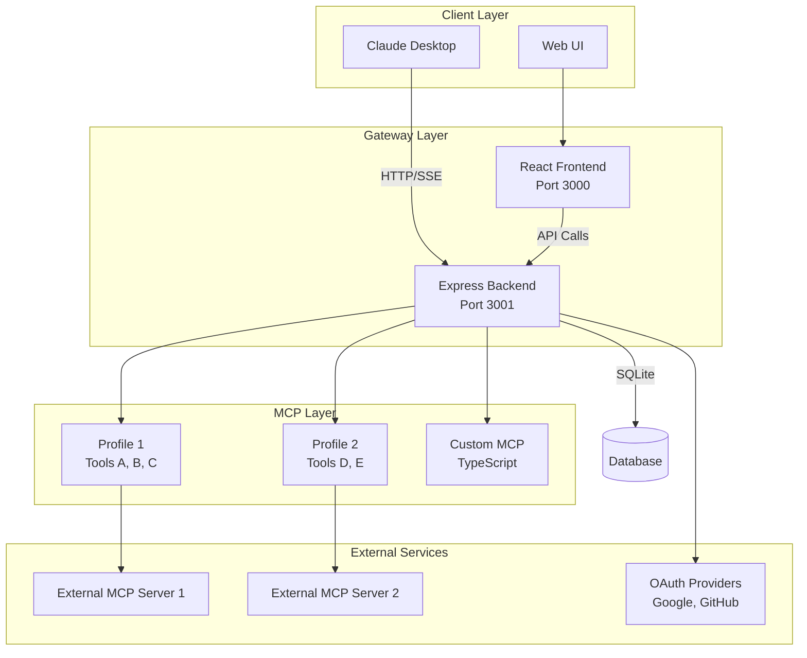
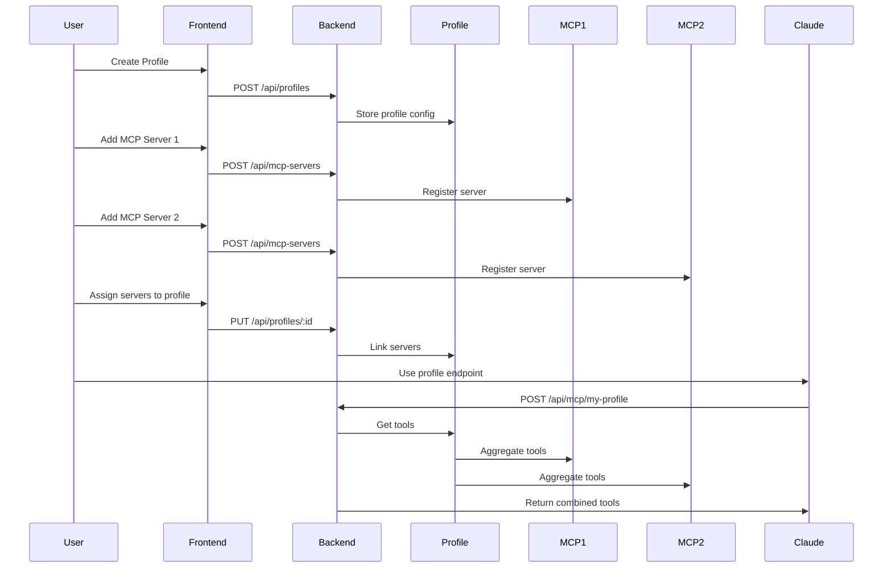
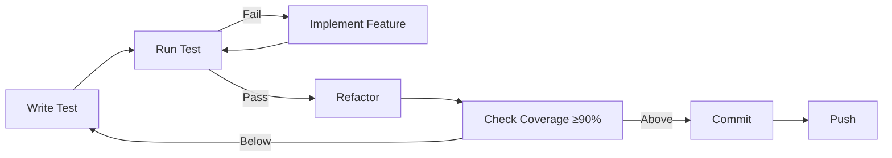

# Root Directory - Local MCP Gateway

## Project Overview

**Local MCP Gateway** is a monorepo application that serves as a local gateway for MCP (Model Context Protocol) servers. It allows users to:

- **Aggregate multiple MCP servers** (stdio, SSE, HTTP) into a single endpoint
- **Create custom MCP servers** using TypeScript with hot-reload support
- **Manage servers via a Web UI** with React 19 frontend
- **Inspect MCP traffic** with built-in debug logging
- **Secure servers** with API keys and OAuth 2.1 (PKCE, DCR)
- **Profile-based tool management** - group MCP servers into profiles for different use cases

This is a **pnpm workspace + Turborepo** monorepo built with:
- **Backend**: Express.js 5 with TypeScript, Better Auth, SQLite (Drizzle ORM)
- **Frontend**: React 19 with Vite, TanStack Query, Zustand, Tailwind CSS
- **Testing**: Vitest (unit/integration), Playwright (E2E)
- **Code Quality**: Biome (linting/formatting), TypeScript strict mode
- **Build**: Turborepo for monorepo orchestration, tsdown for backend bundling

## Setup Commands

### Prerequisites
- **Node.js**: >=20.0.0 (check `.nvmrc` for exact version)
- **pnpm**: >=9.0.0 (specified in `packageManager` field)
- **Docker**: Optional, for containerized deployment

### Initial Setup

```bash
# Install dependencies for all packages
pnpm install

# Setup environment (copies .env.example and generates secrets)
pnpm setup

# Or manually:
cp .env.example .env
# Generate BETTER_AUTH_SECRET (minimum 32 characters):
openssl rand -hex 32
# Edit .env and set BETTER_AUTH_SECRET

# Initialize database with seed data
pnpm db:seed
```

### Development Environment

```bash
# Start both backend and frontend with hot-reload
pnpm dev

# Start only backend
pnpm dev:backend

# Start only frontend
pnpm dev:frontend

# Start with HTTPS tunnel (for Claude Desktop integration)
pnpm dev:https
```

**Ports:**
- Backend: http://localhost:3001
- Frontend: http://localhost:3000
- HTTPS Tunnel: Public URL (displayed in console) → http://localhost:3001

## Build Commands

### Production Build

```bash
# Build all packages and apps
pnpm build

# Build specific package/app
pnpm --filter backend build
pnpm --filter frontend build
```

**Build Output:**
- Backend: `apps/backend/dist/` (bundled with tsdown)
- Frontend: `apps/frontend/dist/` (Vite production build)

### Type Checking

```bash
# Type check all packages
pnpm typecheck

# Type check specific package
pnpm --filter backend typecheck
pnpm --filter frontend typecheck
```

### Linting and Formatting

```bash
# Lint all packages
pnpm lint

# Format all files
pnpm format

# Check formatting without changes
pnpm format:check
```

**Linting Rules (Biome):**
- Single quotes for strings
- Semicolons required
- Trailing commas (ES5 style)
- 2-space indentation
- 100 character line width
- Import type enforcement
- No unused variables
- Security rules (no dangerouslySetInnerHtml)

## Visual Workflows/Diagrams

### System Architecture



### Profile-to-MCP Flow



### Development Workflow



## Agent-Specific Examples

### Example 1: Adding a New API Route

**Context**: You need to add a new REST endpoint to the backend.

**Steps:**
1. **Write test first** (TDD):
   ```bash
   # Create test file
   touch apps/backend/__tests__/unit/routes/my-feature.test.ts
   ```
   ```typescript
   import { describe, it, expect } from 'vitest';
   import request from 'supertest';
   import { app } from '../../src/index';
   
   describe('GET /api/my-feature', () => {
     it('should return 200 with data', async () => {
       const res = await request(app).get('/api/my-feature');
       expect(res.status).toBe(200);
       expect(res.body).toHaveProperty('data');
     });
   });
   ```

2. **Run test** (should fail):
   ```bash
   pnpm --filter backend test:unit
   ```

3. **Implement route**:
   ```typescript
   // apps/backend/src/routes/my-feature.ts
   import { Router } from 'express';
   export const router = Router();
   
   router.get('/', (req, res) => {
     res.json({ data: 'my feature' });
   });
   ```

4. **Register route** in `apps/backend/src/index.ts`

5. **Verify test passes** and coverage ≥90%

### Example 2: Creating a New React Component

**Context**: You need to add a new component to the frontend.

**Steps:**
1. **Write test first**:
   ```typescript
   // apps/frontend/src/__tests__/unit/MyComponent.test.tsx
   import { render, screen } from '@testing-library/react';
   import { MyComponent } from '../../components/MyComponent';
   
   describe('MyComponent', () => {
     it('renders correctly', () => {
       render(<MyComponent />);
       expect(screen.getByText('My Component')).toBeInTheDocument();
     });
   });
   ```

2. **Implement component**:
   ```typescript
   // apps/frontend/src/components/MyComponent.tsx
   export function MyComponent() {
     return <div>My Component</div>;
   }
   ```

3. **Run tests**:
   ```bash
   pnpm --filter frontend test:unit
   ```

### Example 3: Adding a New Package

**Context**: You need to create a new shared package.

**Steps:**
1. **Use helper script**:
   ```bash
   pnpm create-package
   # Follow prompts to create package structure
   ```

2. **Or manually**:
   ```bash
   mkdir -p packages/my-package/src
   # Create package.json, tsconfig.json, vitest.config.ts
   ```

3. **Add to workspace**: Already included via `pnpm-workspace.yaml`

4. **Write tests** in `packages/my-package/__tests__/`

5. **Export from** `packages/my-package/src/index.ts`

### Example 4: Working with Database

**Context**: You need to add a new database table or modify schema.

**Steps:**
1. **Create migration**:
   ```bash
   cd packages/database
   pnpm drizzle-kit generate
   ```

2. **Review migration** in `packages/database/src/migrations/`

3. **Apply migration**:
   ```bash
   pnpm drizzle-kit migrate
   ```

4. **Update repository** in `packages/database/src/repositories/`

5. **Write tests** for repository methods

### Example 5: Adding E2E Test

**Context**: You need to test a complete user flow.

**Steps:**
1. **Create test file**:
   ```typescript
   // apps/frontend/e2e/my-feature.spec.ts
   import { test, expect } from '@playwright/test';
   
   test('user can complete flow', async ({ page }) => {
     await page.goto('/');
     // ... test steps
   });
   ```

2. **Run E2E tests**:
   ```bash
   pnpm test:e2e
   ```

3. **Debug interactively**:
   ```bash
   pnpm --filter frontend test:e2e:ui
   ```

## Terminology and Context

### Core Concepts

- **MCP (Model Context Protocol)**: Protocol for AI assistants to access external tools and data
- **Profile**: A named collection of MCP servers that can be accessed via a single endpoint (e.g., `/api/mcp/my-profile`)
- **MCP Server**: An implementation of the MCP protocol that provides tools/resources/prompts
- **Tool**: A function that an AI can call (e.g., `read_file`, `search_web`)
- **Resource**: Data that an AI can access (e.g., files, database records)
- **Prompt**: Template for generating AI prompts with context

### Server Types

- **stdio**: MCP server running as a subprocess (stdin/stdout communication)
- **SSE**: Server-Sent Events (HTTP streaming)
- **HTTP**: REST API endpoint
- **Custom**: TypeScript-based MCP server loaded dynamically

### Authentication

- **OAuth 2.1**: Modern OAuth with PKCE (Proof Key for Code Exchange) and DCR (Dynamic Client Registration)
- **API Key**: Simple authentication for server-to-server communication
- **Better Auth**: Authentication library used in backend

### Architecture Terms

- **Gateway**: The Local MCP Gateway application that aggregates multiple MCP servers
- **Proxy**: The gateway acts as a proxy, forwarding requests to appropriate MCP servers
- **Aggregation**: Combining tools from multiple MCP servers into a single profile endpoint

## Code Style

### TypeScript

- **Strict mode**: Enabled in all `tsconfig.json` files
- **Module system**: ES modules (`"type": "module"` in package.json)
- **Import style**: Use `import type` for type-only imports (enforced by Biome)
- **Naming**: 
  - Components: PascalCase (`MyComponent.tsx`)
  - Files: kebab-case for non-components (`my-utils.ts`)
  - Types/Interfaces: PascalCase (`UserProfile`, `McpServer`)

### Formatting (Biome)

- **Indentation**: 2 spaces
- **Line width**: 100 characters
- **Quotes**: Single quotes for strings
- **Semicolons**: Always required
- **Trailing commas**: ES5 style (objects, arrays)
- **Import organization**: Auto-organized by Biome

### Linting Rules

**Errors (must fix):**
- `noUnusedVariables`: Unused variables/imports
- `noBannedTypes`: Avoid `any`, `Function`, etc.
- `useImportType`: Use `import type` for types
- `noDangerouslySetInnerHtml`: Security rule

**Warnings (should fix):**
- `useExhaustiveDependencies`: React hook dependencies
- `noUselessTypeConstraint`: Unnecessary type constraints

### File Organization

```
apps/backend/src/
├── handlers/        # Request handlers (business logic)
├── routes/          # Express route definitions
├── middleware/      # Express middleware
└── lib/            # Shared utilities

apps/frontend/src/
├── components/     # React components
├── pages/          # Page components (routes)
├── lib/            # Shared utilities
└── utils/          # Helper functions
```

## Testing Instructions

### Test Structure

- **Unit tests**: `__tests__/unit/` - Test individual functions/components in isolation
- **Integration tests**: `__tests__/integration/` - Test multiple components together
- **E2E tests**: `apps/frontend/e2e/` - Test complete user flows with Playwright

### Running Tests

```bash
# Run all tests
pnpm test

# Unit tests only
pnpm test:unit

# Integration tests only
pnpm test:integration

# E2E tests
pnpm test:e2e

# Watch mode (unit/integration)
pnpm test:watch

# Coverage report (must be ≥90%)
pnpm test:coverage
```

### Coverage Requirements

**Minimum thresholds (enforced in `vitest.config.ts`):**
- Statements: 90%
- Branches: 90%
- Functions: 90%
- Lines: 90%

**Coverage exclusions:**
- `node_modules/`
- `dist/`, `build/`
- `__tests__/`, `*.test.ts`, `*.spec.ts`
- `e2e/`
- Config files

### Test Best Practices

1. **TDD First**: Write tests before implementation
2. **Isolation**: Each test should be independent
3. **Naming**: Descriptive test names (`it('should return 200 when user is authenticated')`)
4. **Arrange-Act-Assert**: Clear test structure
5. **Mocking**: Use MSW (Mock Service Worker) for API mocking in frontend tests
6. **Fixtures**: Use test fixtures for consistent test data

### E2E Testing

**Playwright Configuration:**
- Test directory: `apps/frontend/e2e/`
- Base URL: `http://localhost:3000`
- Auto-starts backend and frontend servers
- Uses Chromium by default

**E2E Helpers:**
- `apps/frontend/e2e/helpers.ts` - Shared utilities
- `apps/frontend/e2e/pages/` - Page object models

**Running E2E:**
```bash
# Run all E2E tests
pnpm test:e2e

# Run with UI (interactive)
pnpm --filter frontend test:e2e:ui

# Run in headed mode (see browser)
pnpm --filter frontend test:e2e:headed

# Debug mode
pnpm --filter frontend test:e2e:debug
```

## Development Workflow

### Git Workflow

1. **Create feature branch**: `git checkout -b feature/my-feature`
2. **Write tests first** (TDD)
3. **Implement feature**
4. **Run all checks**: `pnpm check` (lint + typecheck + test + build)
5. **Ensure coverage ≥90%**: `pnpm test:coverage`
6. **Commit**: Use conventional commits (optional but recommended)
7. **Push and create PR**

### Turborepo Pipeline

**Task Dependencies:**
- `build` depends on `^build` (build dependencies first)
- `test` depends on `build` (build before testing)
- `lint` depends on `^lint` (lint dependencies first)

**Caching:**
- Build outputs cached in `.turbo/`
- Test results cached (unless `test:watch`)
- Lint results cached

### Hot Reload

**Backend:**
- Uses `tsx watch` for hot reload
- Restarts on file changes in `apps/backend/src/`

**Frontend:**
- Uses Vite HMR (Hot Module Replacement)
- Instant updates without page refresh

### Database Development

**Local Database:**
- Location: `~/.local-mcp-gateway-data/local-mcp-gateway.db`
- Managed by Drizzle ORM
- Migrations in `packages/database/src/migrations/`

**Reset Database:**
```bash
pnpm db:reset  # Deletes DB and reseeds
```

**Seed Data:**
```bash
pnpm db:seed  # Runs seed scripts
```

## Project Structure

```
local-mcp-gateway/
├── apps/                          # Applications
│   ├── backend/                   # Express.js backend
│   │   ├── src/
│   │   │   ├── handlers/         # Request handlers
│   │   │   ├── routes/           # Express routes
│   │   │   ├── middleware/       # Express middleware
│   │   │   └── lib/              # Utilities (auth, db, logger)
│   │   ├── __tests__/
│   │   │   ├── unit/             # Unit tests
│   │   │   └── integration/      # Integration tests
│   │   └── package.json
│   └── frontend/                  # React 19 frontend
│       ├── src/
│       │   ├── components/       # React components
│       │   ├── pages/            # Page components
│       │   ├── lib/              # Shared libraries
│       │   └── utils/            # Helper functions
│       ├── e2e/                  # Playwright E2E tests
│       ├── __tests__/            # Unit/integration tests
│       └── package.json
├── packages/                      # Shared packages
│   ├── core/                      # Core abstractions (MCP types, interfaces)
│   ├── database/                 # Database layer (Drizzle ORM)
│   │   ├── src/
│   │   │   ├── migrations/       # Database migrations
│   │   │   ├── repositories/     # Data access layer
│   │   │   └── seeds/            # Seed data
│   ├── custom-mcp-loader/        # Custom MCP server loader
│   ├── config/                   # Shared configuration
│   ├── ui/                        # Shared UI components
│   └── emails/                   # Email templates
├── custom-mcps/                   # User-created custom MCPs
│   └── example-mcp/              # Example custom MCP
├── docs/                          # Documentation
│   ├── introduction/             # Getting started
│   ├── how-to/                   # How-to guides
│   ├── tutorials/               # Step-by-step tutorials
│   ├── reference/               # API reference
│   └── explanation/              # Architecture explanations
├── spec/                          # Specification documents
├── scripts/                      # Utility scripts
├── .cursor/                       # Cursor IDE configuration
├── package.json                   # Root package.json
├── pnpm-workspace.yaml            # pnpm workspace config
├── turbo.json                     # Turborepo config
├── vitest.config.ts               # Vitest config
├── playwright.config.ts           # Playwright config
├── biome.json                     # Biome linting/formatting
└── docker-compose.yml             # Docker Compose config
```

## Dependencies

### Root Dependencies

**Runtime:**
- `better-auth`: Authentication library
- `jsonwebtoken`: JWT handling
- `bcrypt`: Password hashing
- `nodemailer`: Email sending
- `@noble/ed25519`, `@noble/hashes`: Cryptographic operations

**Dev:**
- `turbo`: Monorepo build system
- `vitest`: Unit/integration testing
- `@playwright/test`: E2E testing
- `@biomejs/biome`: Linting and formatting
- `typescript`: Type checking
- `drizzle-kit`: Database migrations
- `drizzle-orm`: ORM

### Backend Dependencies

- `express`: Web framework
- `@modelcontextprotocol/sdk`: MCP SDK
- `cors`: CORS middleware
- `helmet`: Security headers
- `express-rate-limit`: Rate limiting
- `winston`: Logging
- `zod`: Schema validation
- `compression`: Response compression

### Frontend Dependencies

- `react`, `react-dom`: React 19
- `react-router`: Routing
- `@tanstack/react-query`: Data fetching
- `zustand`: State management
- `@toon-format/toon`: TOON format for AI prompts
- `lucide-react`: Icons
- `zod`: Schema validation

### Workspace Packages

All packages use workspace protocol (`workspace:*`):
- `@dxheroes/local-mcp-core`
- `@dxheroes/local-mcp-database`
- `@dxheroes/local-mcp-config`
- `@dxheroes/local-mcp-custom-mcp-loader`
- `@dxheroes/local-mcp-ui`
- `@dxheroes/local-mcp-emails`

## Environment Variables

### Required Variables

**`BETTER_AUTH_SECRET`** (required, minimum 32 characters)
- Used for session encryption
- Generate with: `openssl rand -hex 32`

### Optional Variables

**Database:**
- `DATABASE_PATH`: Path to SQLite database (default: `~/.local-mcp-gateway-data/local-mcp-gateway.db`)

**Server:**
- `PORT`: Backend port (default: 3001)
- `NODE_ENV`: Environment (`development`, `production`, `test`)
- `LOG_LEVEL`: Logging level (`error`, `warn`, `info`, `debug`)

**CORS:**
- `CORS_ORIGINS`: Comma-separated list of allowed origins

**OAuth (Google):**
- `GOOGLE_CLIENT_ID`
- `GOOGLE_CLIENT_SECRET`

**OAuth (GitHub):**
- `GITHUB_CLIENT_ID`
- `GITHUB_CLIENT_SECRET`

**Email (Resend):**
- `RESEND_API_KEY`
- `EMAIL_FROM`

**Payments (Paddle):**
- `PADDLE_API_KEY`
- `PADDLE_WEBHOOK_SECRET`
- `PADDLE_ENVIRONMENT`: `sandbox` or `production`

**Licensing:**
- `LICENSE_PRIVATE_KEY`: Ed25519 private key
- `LICENSE_PUBLIC_KEY`: Ed25519 public key

**Monitoring:**
- `SENTRY_DSN`: Sentry error tracking

**Frontend:**
- `VITE_API_URL`: Backend API URL (default: `http://localhost:3001`)

**Environment Setup:**
See `docs/ENVIRONMENT_SETUP.md` for detailed configuration guide.

## Security Considerations

### Input Validation

- **All inputs validated** using Zod schemas
- **SQL injection prevention**: Use Drizzle ORM (parameterized queries)
- **XSS prevention**: React automatically escapes, avoid `dangerouslySetInnerHtml`
- **CSRF protection**: Built into Better Auth

### Authentication

- **OAuth 2.1**: PKCE and DCR for security
- **API Keys**: Stored hashed in database
- **JWT**: Used for session tokens
- **Password hashing**: bcrypt with salt rounds

### Security Headers

- **Helmet.js**: Sets security headers (CSP, HSTS, etc.)
- **CORS**: Configurable allowed origins
- **Rate limiting**: Express rate limiter on API routes

### Best Practices

1. **Never commit secrets**: Use `.env` files (in `.gitignore`)
2. **Validate all inputs**: Use Zod schemas
3. **Use parameterized queries**: Drizzle ORM handles this
4. **Sanitize user input**: Before displaying in UI
5. **Keep dependencies updated**: Regular security audits
6. **Use HTTPS in production**: Required for OAuth

## Performance Requirements

### Backend

- **Response time**: <200ms for API endpoints (p95)
- **Concurrent requests**: Support 100+ concurrent connections
- **Database queries**: Optimized with indexes, connection pooling

### Frontend

- **Initial load**: <3s for first contentful paint
- **Bundle size**: Keep main bundle <500KB (gzipped)
- **Code splitting**: Use React lazy loading for routes
- **Image optimization**: Use appropriate formats and sizes

### Testing

- **Test execution**: Unit tests <5s, integration <30s, E2E <2min
- **Coverage**: Maintain ≥90% coverage

### Monitoring

- **Error tracking**: Sentry integration (optional)
- **Logging**: Winston with structured logging
- **Debug logs**: Available in Web UI for MCP traffic inspection

## Debugging and Troubleshooting

### Backend Debugging

**Logs:**
- Logs written to console (Winston)
- Log level controlled by `LOG_LEVEL` env var
- Debug logs available via `/api/debug/logs` endpoint

**Common Issues:**
1. **Port already in use**: Change `PORT` in `.env`
2. **Database locked**: Check if another process is using SQLite
3. **OAuth errors**: Verify client ID/secret in `.env`

**Debug Mode:**
```bash
LOG_LEVEL=debug pnpm dev:backend
```

### Frontend Debugging

**React DevTools:**
- Install React DevTools browser extension
- Inspect component state and props

**Network Debugging:**
- Open browser DevTools → Network tab
- Check API requests/responses
- Verify `VITE_API_URL` is correct

**Common Issues:**
1. **API connection failed**: Check `VITE_API_URL` matches backend port
2. **CORS errors**: Verify `CORS_ORIGINS` includes frontend URL
3. **Build errors**: Clear `node_modules` and reinstall

### Database Debugging

**Inspect Database:**
```bash
sqlite3 ~/.local-mcp-gateway-data/local-mcp-gateway.db
```

**Reset Database:**
```bash
pnpm db:reset
```

### MCP Server Debugging

**Debug Logs:**
- Available in Web UI: `/debug-logs`
- Shows all MCP requests/responses
- Filter by profile, server, or time range

**Common Issues:**
1. **Server not responding**: Check server process is running
2. **OAuth errors**: Verify OAuth configuration
3. **Tool not found**: Check server registration and profile assignment

### E2E Test Debugging

**Interactive Debugging:**
```bash
pnpm --filter frontend test:e2e:ui
```

**Headed Mode:**
```bash
pnpm --filter frontend test:e2e:headed
```

**Debug Mode:**
```bash
pnpm --filter frontend test:e2e:debug
```

### Performance Debugging

**Backend:**
- Use `LOG_LEVEL=debug` to see request timing
- Check database query performance
- Monitor memory usage

**Frontend:**
- Use React DevTools Profiler
- Check bundle size with `pnpm --filter frontend build`
- Use Lighthouse for performance audit

## Key Principles

1. **TDD First**: All code must have tests before implementation (90% coverage minimum)
2. **Documentation**: All code must be documented (JSDoc, guides, examples)
3. **Security**: All inputs validated, SQL injection prevention, XSS prevention
4. **Type Safety**: Full TypeScript strict mode
5. **Hot Reload**: Both backend and frontend support hot-reload in dev mode

## Child Directories

Each directory has its own `AGENTS.md` with specific instructions:

- **[packages/AGENTS.md](packages/AGENTS.md)** - Shared packages overview
- **[apps/AGENTS.md](apps/AGENTS.md)** - Applications (backend, frontend)
- **[custom-mcps/AGENTS.md](custom-mcps/AGENTS.md)** - Custom MCP servers
- **[docs/AGENTS.md](docs/AGENTS.md)** - Documentation structure

## Root Configuration Files

- `package.json` - Root package.json with workspace scripts
- `pnpm-workspace.yaml` - pnpm workspace configuration
- `turbo.json` - Turborepo pipeline configuration
- `vitest.config.ts` - Vitest configuration for unit/integration tests
- `playwright.config.ts` - Playwright configuration for E2E tests
- `biome.json` - Biome linting and formatting configuration
- `docker-compose.yml` - Docker Compose configuration
- `.env.example` - Environment variables template
- `README.md` - Main project README
- `CONTRIBUTING.md` - Contributing guidelines

## Important Notes

- Always follow TDD: Write tests first, then implement
- Code coverage must be ≥90% before merging
- All public APIs must have JSDoc comments
- Documentation must be updated with code changes
- Security validations are mandatory for all inputs
- Refer to implementation plans for detailed requirements and architecture decisions
- Use TOON format (not JSON/MD) for AI prompt data structures
- Data persistence: All data stored in `~/.local-mcp-gateway-data` (home directory)
