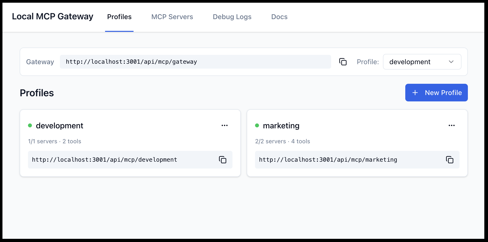
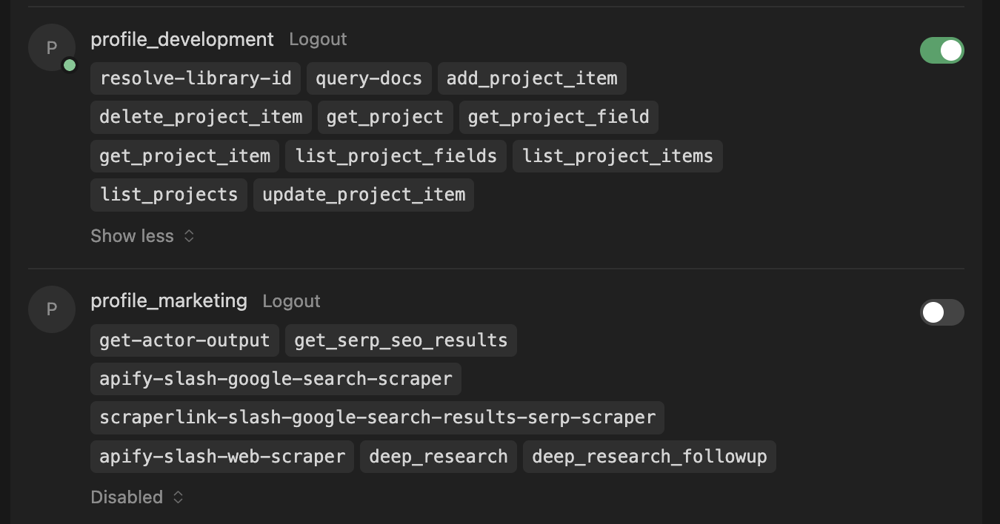

# Local MCP Gateway

The **Middleware Layer** for your AI tools.

As AI clients multiply (Claude, Cursor, IDEs) and MCP servers proliferate (GitHub, Postgres, Slack), direct connections create an N×M fragmentation problem. Debugging is a nightmare, security is an afterthought, and context overload degrades model performance.

**Local MCP Gateway** is the Control Plane that solves this. It acts as a central hub where you configure your MCP servers once and expose them through curated **Profiles**—giving each AI assistant exactly the tools it needs, nothing more.

**Local First**: Your data and tools stay under your control. No cloud dependency, no SaaS API keys.



```json
{
  "mcpServers": {
    "profile_development": {
      "type": "http",
      "url": "http://localhost:3000/api/mcp/development"
    },
    "profile_marketing": {
      "type": "http",
      "url": "http://localhost:3000/api/mcp/marketing"
    }
  }
}
```



## Quick Start with Docker (Recommended)

Run Local MCP Gateway instantly without cloning the repository:

```bash
curl -fsSL https://raw.githubusercontent.com/DXHeroes/local-mcp-gateway/main/docker-compose.hub.yml -o local-mcp-gateway.yml && docker compose -f local-mcp-gateway.yml up -d
```

- **UI**: http://localhost:9630
- **MCP Endpoint**: http://localhost:9631/api/mcp/default
- **Data**: Stored in `~/.local-mcp-gateway-data/`

To stop: `docker compose -f local-mcp-gateway.yml down`

For more details, see [Docker Quick Start Guide](./docs/how-to/docker-quickstart.md).

## Features

-   🚀 **Proxy & Aggregator**: Combine multiple MCP servers (stdio, SSE, remote) into one
-   🛠️ **Custom MCP Support**: Write your own MCP servers in TypeScript with hot-reload
-   🔒 **Security**: Built-in API Key management and OAuth 2.1 support
-   📊 **Observability**: Real-time request/response logging and inspection
-   🖥️ **Web Interface**: Modern UI to manage servers, profiles, and logs
-   🐳 **Docker Ready**: Easy deployment with Docker Compose

## Development Setup

If you want to develop or build from source:

### Prerequisites

-   Node.js 22+
-   pnpm 9+

### Installation

```bash
# Install dependencies
pnpm install

# Initialize database
pnpm db:seed

# Start development
pnpm dev
```

### Development

Start both backend and frontend with hot-reload:

```bash
pnpm dev
```

- Backend: http://localhost:3001
- Frontend: http://localhost:3000

**For Claude Desktop (HTTPS):**

Start with HTTPS tunnel (using `localtunnel`):

```bash
pnpm dev:https
```

- Backend: http://localhost:3001
- HTTPS Tunnel: Public URL (displayed in console) -> http://localhost:3001
- Frontend: http://localhost:3000 (configured to show the HTTPS tunnel URL)

Use the HTTPS tunnel URL in your `mcp.json` configuration to avoid SSL certificate errors in Claude Desktop.

### Building

```bash
pnpm build
```

### Testing

```bash
# Run all tests
pnpm test

# Unit tests only
pnpm test:unit

# Integration tests
pnpm test:integration

# E2E tests
pnpm test:e2e

# Coverage
pnpm test:coverage
```

## Production Usage

### Running Locally (Bare Metal)

To run the production build locally:

```bash
pnpm start
```

This will:
1. Build the application.
2. Start the backend on http://localhost:3001.
3. Start the frontend on http://localhost:3000.

**Data Persistence:**
Data is stored in `~/.local-mcp-gateway-data` (your home directory) to ensure it persists across restarts and updates.

### Running with Docker (from source)

Build and run from source using Docker:

```bash
docker compose up -d --build
```

This provides:
- **UI**: http://localhost:3000
- **Backend API**: http://localhost:3001
- **MCP Endpoint**: http://localhost:3001/api/mcp/default
- **Data**: Stored in `~/.local-mcp-gateway-data/`

## Integration with Claude Desktop

1.  Run `pnpm dev:https`
2.  Copy the public HTTPS URL from the terminal (e.g., `https://blue-sky-42.loca.lt`)
3.  Configure your `mcp.json`:
    ```json
    "My Profile": {
      "type": "http",
      "url": "https://blue-sky-42.loca.lt/api/mcp/my-profile"
    }
    ```
4.  **AI Prompt**: In the frontend (Profile page), copy the "AI Prompt" (TOON format) and paste it into your chat to give the AI full context about available tools.

## Project Structure

```
local-mcp-gateway/
├── packages/          # Shared packages
│   ├── core/          # Core types and abstractions
│   ├── database/      # Prisma ORM + SQLite
│   ├── config/        # Shared configuration
│   └── ui/            # Shared UI components
├── apps/              # Applications
│   ├── backend/       # NestJS 11.x backend
│   └── frontend/      # React 19 frontend
├── mcp-servers/       # MCP server packages (auto-discovered)
└── docs/              # Documentation
```

## Features

- ✅ Profile management
- ✅ MCP server management
- ✅ OAuth 2.1 support (PKCE, DCR)
- ✅ API key management
- ✅ MCP proxy endpoints per profile
- ✅ Debug logging
- ✅ **HTTPS Tunneling** for Claude Desktop
- ✅ **AI Prompt Generation** (TOON format) for easy context sharing

## License

[Elastic License 2.0](./LICENSE) - Free to use, modify, and distribute. Cannot be provided as a hosted service to third parties.
