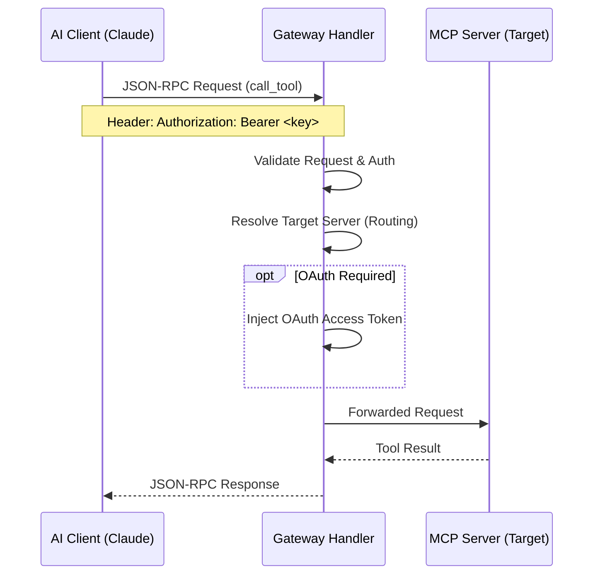

# Architecture Overview

This document explains the high-level architecture of the Local MCP Gateway.

## Component Diagram

```mermaid
graph TB
    subgraph "Clients (AI)"
        Claude[Claude Desktop/Code]
        Cursor[Cursor IDE]
    end

    subgraph "Local MCP Gateway"
        Backend[Backend Server<br/>(NestJS)]
        FE[Frontend<br/>(React 19)]
        DB[(SQLite DB<br/>via Prisma)]

        Backend -- Reads/Writes --> DB
        FE -- REST API --> Backend
    end

    subgraph "MCP Servers"
        RemoteHTTP[Remote HTTP Server]
        RemoteSSE[Remote SSE Server]
        Stdio[External Process<br/>(Stdio)]
        Builtin[Built-in MCP Package<br/>(mcp-servers/)]
    end

    subgraph "Tunneling"
        LocalTunnel[localtunnel]
    end

    %% Flows
    Claude -- HTTPS (Public URL) --> LocalTunnel
    LocalTunnel -- HTTP (3001) --> Backend
    Cursor -- HTTP (3001) --> Backend

    Backend -- HTTP/SSE --> RemoteHTTP
    Backend -- SSE --> RemoteSSE
    Backend -- Stdio --> Stdio
    Backend -- Direct Call --> Builtin

    classDef client fill:#e1f5fe,stroke:#01579b
    classDef server fill:#e8f5e9,stroke:#2e7d32
    classDef mcp fill:#fff3e0,stroke:#33691e

    class Claude,Cursor client
    class Backend,FE,DB,LocalTunnel server
    class RemoteHTTP,RemoteSSE,Stdio,Builtin mcp
```

## Request Flow

When an AI client requests a list of tools or calls a tool, the request flows through the Gateway:



